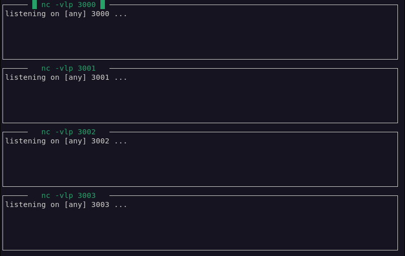

# mwatch
A nice linux terminal process watcher



**Usage**
---
```
usage: mwatch [-h] conf

positional arguments:
  conf        configuration file

optional arguments:
  -h, --help  show this help message and exit

Create a TOML configuration file listing what you want to execute.
Here is an example configuration:

    [[slot]]
        run = "nc -vlp 3920"
        workdir = "/tmp/"

    [[slot]]
        run = "sleep 3600"
```

**Installation**
---

1. Local install with pip
  + `$ poetry build`
  + `$ pip install ./dist/mwatch-*whl`
  
